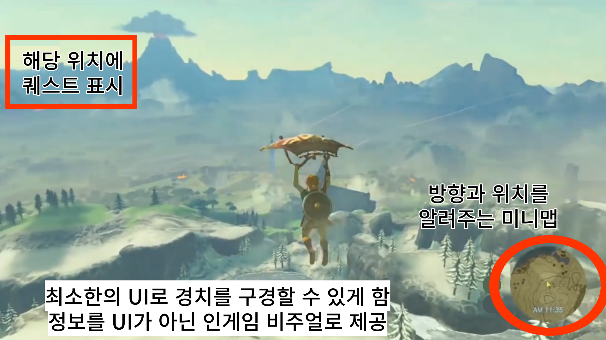

# Whatever

# [컨셉]

## 메인컨셉 :

큰 목적 없이 떠나는 방대한 모험

### 서브 컨셉 1 :

- 어드벤처
- 오픈 월드는 항상 다른 장르와 합쳐진 형태로 구현되는데, 어드벤처가 가장 오픈월드와 어울리는 장르라고 생각한다. 어드벤처라는 컨셉을 살리기 위해 맵을 탐사했을 때 플레이하는데 도움을 줄 수 있는 리워드를 제공하고자 한다.

### 서브 컨셉 2 :

- 캐주얼
- 오픈 월드의 특성 상 리소스 관리가 정말 어렵다. 폴리곤을 줄이기 위해 로우폴리 그래픽에 캐주얼한 디자인을 선택할 예정이다. 대신 쉐이더와 라이팅 기능에 많은 투자를 해서 캐주얼한 그래픽에서도 플레이어들이 긍정적인 평가를 이끌어내고자 한다. 

### 서브 컨셉 3 :

- 지형과 상호작용
- 상호작용을 할 수 있는 지형 요소를 넣을 생각이다. 지형과 상호작용을 통해 갈 수 없는 지형을 갈 수 있게 할 생각이다. 단순히 맵을 돌아다니기만 하면 쉽게 지루해질 수 있기 때문에 분위기를 환기시킬 수단으로 사용하고자 한다.

### 서브 컨셉 4 :

- 글라이딩
- 넓은 지형을 가시적으로 보여줄 수 있는 방법으로 글라이딩을 생각했다. 글라이딩을 하면서 본인이 지나다녔던 길들을 한 눈에 보여주고자 한다.

### 서브 컨셉 5 :

- 모험가
- 모험가라는 컨셉으로 로프, 모자같은 요소들로 위 요소들의 개연성과 통일감을 주고자 한다.

  

# [관련 이미지 & 동영상]

- 이미지  

- 동영상
  

  

# [대표 이미지]

  

# [컨셉 & 대표이미지 기반 작품묘사]

> ### 대표이미지 기반 :

> ### 컨셉 기반:

  

# [<게임제목> 구성 요소]

- 가나다라마바사아차카타파하 가나다라마바사아차카타파하

 

## 1. 메커니즘

[도전 과제]

1. 가나다라마바사아차카타파하
2. 가나다라마바사아차카타파하

[재미 요소]

1. 가나다라마바사아차카타파하
2. 가나다라마바사아차카타파하

 

## 2. 이야기

[만들게 된 배경]  
가나다라마바사아차카타파하 가나다라마바사아차카타파하

[카메라 관점]  
가나다라마바사아차카타파하 가나다라마바사아차카타파하

 

## 3. 미적요소

[디자인][컬러]  
가나다라마바사아차카타파하 가나다라마바사아차카타파하

[음향]  
가나다라마바사아차카타파하 가나다라마바사아차카타파하
 

## 4. 기술

가나다라마바사아차카타파하 가나다라마바사아차카타파하
