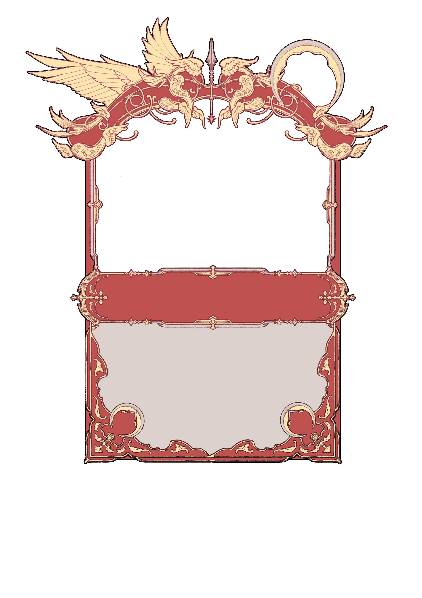

# PyDoingMe.github.io

# 프로젝트 명 : About Chivalry (이창현)

# [ 목차 ]
### 1. [컨셉](#1)
### 2. [관련 이미지와 동영상](#2)
### 3. [컨셉 & 대표이미지 기반 작품 묘사](#0)
### 4. [About Chivalry 구성 요소](#4)
### 5. [게임 시스템 디자인](#5)
### 6. [요구사항](#6)

  

# [컨셉] 

## 메인컨셉 :

중세/판타지 기사를 메인으로한 카드 게임 

### 서브 컨셉 1 :

- 분쟁/기사
- 여러 왕국들이 모여있는 대륙에 분쟁이 끝나지 않자, 전쟁을 대신할 수 있는 수단으로 기사를 선택했다는 컨셉이다. 국왕이 되어 기사들을 전장에 배치하고, 명령내릴 수 있다.

### 서브 컨셉 2 :

- 중세/판타지
- 기사만 가질 수 있는 특별한 능력 기사도와 명장들이 만들어낸 마스터피스 무기들은 각기 다른 효과를 가진 카드로써 표현되었다. 다양한 능력들을 가진 카드들이 만들어낸 시너지로 경기의 판도를 뒤집을 수 있다.

### 서브 컨셉 3 :

- 카드/덱
- 다양한 종류의 카드를 자신만의 전략으로 구성해 매 판 새로운 구도의 게임을 할 수 있게 해준다.

  

# [관련 이미지] 

- 이미지 1  
  
- 이미지 2  
  
- 이미지 3  
  

  

# [작품묘사] 

동 장르 'TCG(CCG)'의 대표격 게임인 매직 더 게더링의 시스템을 베이스로 게임을 설계했으며, 웹툰 '잔불의 기사'에 큰 영감을 받아 세부 컨셉이 정해졌다. 대부분의 카드들이 공격력보다 체력이 높게 설계되었으며, 후반 부에 낼 수 있는 카드들이 압도적인 강함을 가지게 의도적으로 설계해 역전이 용이한 게임을 기획했다.

  

# [About Chivalry 구성 요소] 
제목
- About Chivalry

 

## 1. 메커니즘

[도전 과제]

1. 카드를 수집하라
2. 나만의 덱과 전략을 수립하라
3. 매 판 바뀌는 상황과 상대의 덱에 능동적으로 대처해서 승리하라

[재미 요소]

1. 카드 수집
2. 덱 빌딩
3. 게임 설계

 

## 2. 이야기

[만들게 된 배경]  

기존의 만들던 게임인 오픈월드 장르의 게임은 제가 너무 만들기 싫었습니다. 그 이유는 제가 기획을 너무 거대하게 잡아서, 해야될 일이 많았기 때문입니다. 그래서 결단을 내야만 했습니다. 의지와 완성 가능성이 희박한 게임을 계속 잡고 있을 지, 아니면 짧은 기간 내에 기존의 게임보다 퀄리티를 높게 뽑을 수 있을 법한 자신 있는 게임을 만들 지에 대해 고민한 결과, 기간 내에 최고의 결과를 도출하기 위해서는 기존의 게임을 질질 끌고 가는 것 보다 자신있는 새로운 게임을 만들면 단기간 내에 더 적은 코스트로 더 높은 퀄리티의 결과물을 도출할 수 있다는 계산이 떨어져 진행하게 되었습니다.

 

## 3. 미적요소

[디자인][컬러]  
카드 디자인 
- 두꺼운 종이 혹은 가죽에 금속 장식이 되어있는 듯한 카드

배경/환경 디자인 
- 4K 중세 건물

[음향]  
- 클래식 음악을 배경음악으로 선택해서 급박한 전투와 중세 느낌을 살릴 예정

 

## 4. 기술

DoTween
- 유니티 오브젝트의 transform 조작을 편리하게 도와주는 네임스페이스

3Ds Max
- 카드의 금속 질감을 살리기 위한 모델링/UV 맵핑 진행. 이를 바탕으로 유니티 머테리얼 적용

구글 스프레드 시트
- 게임의 정보를 구글 스프레드 시트에 저장하고, 이를 게임에서 실시간으로 다운받는 형태로 제작을 해서 유지보수의 장점을 가져감

 

# [게임 시스템 디자인] 

## 게임 오브젝트 분해

<table>
<thead>
<tr>
<th align="center">오브젝트 이름</th>
<th align="center">오브젝트 분류</th>
<th align="center">오브젝트 이미지</th>
</tr>
</thead>
<tbody>
<tr>
<td align="center">Card</td>
<td align="center">Card</td>
<td align="center"></td>
</tr>
<tr>
<td align="center">배경</td>
<td align="center">배경</td>
<td align="center"></td>
</tr>
<tr>
<td align="center">UI</td>
<td align="center">UI</td>
<td align="center"></td>
</tr>
</tbody>
</table>
 

## 게임의 규칙

- 랜 멀티플레이 게임이 가능하도록 개발
- 게임은 일대일, 턴제로 진행되며, 두 플레이어가 번갈아 턴을 진행함
- 게임이 시작되면 두 플레이어가 카드 4장을 뽑고, 두 플레이어 중 무작위 한 명이 우선해서 턴을 진행
- 턴이 시작되면 카드 1장을 뽑고 코스트를 획득
- 코스트의 초기값은 0이며 턴 마다 1씩 증가
- 자신의 턴 동안 핸드에서 카드를 필드에 낼 수 있음
- 자신의 턴이 시작되면 자신 필드의 카드들은 공격권을 획득
- 자신의 턴 동안 필드의 카드로 상대의 카드를 공격권을 소모하고 공격할 수 있음
- 카드는 체력과 공격력을 가지고 있음
- 공격하면 공격하는 카드와 공격 당하는 카드 모두, 서로의 공격력만큼 체력 감소
- 카드의 체력이 0 이하가 되면 카드 파괴
- 두 플레이어는 필드에 성문카드를 1개 씩 가지고 게임을 시작함
- 8턴이 지나거나, 두 플레이어의 성문카드 중 하나라도 파괴되면 게임 종료
- 게임 종료 시, 두 플레이어 중 상대의 성문카드를 파괴하거나, 더 많은 피해를 입힌 플레이어가 승리

 

# [요구사항] 
- 카드 디자인은 외주로 제작한다.
- 지형을 에셋을 사용해 제작한다.
- 카드 모델링은 3ds Max를 사용해 제작한다.
- 씬은 인게임/덱수정/홈 총 3개로 구성된다.
- 씬-홈은 게임시작/내 카드/게임 종료 총 3개의 버튼으로 구성된다.
- 덱은 Json파일로 정보를 저장된다.
- 게임시작을 누르면 방파기/방 들어가기를 선택할 수 있고, 종료를 누르면 게임이 종료된다.
- 게임을 시작하면 선공이 정해진다.

 

