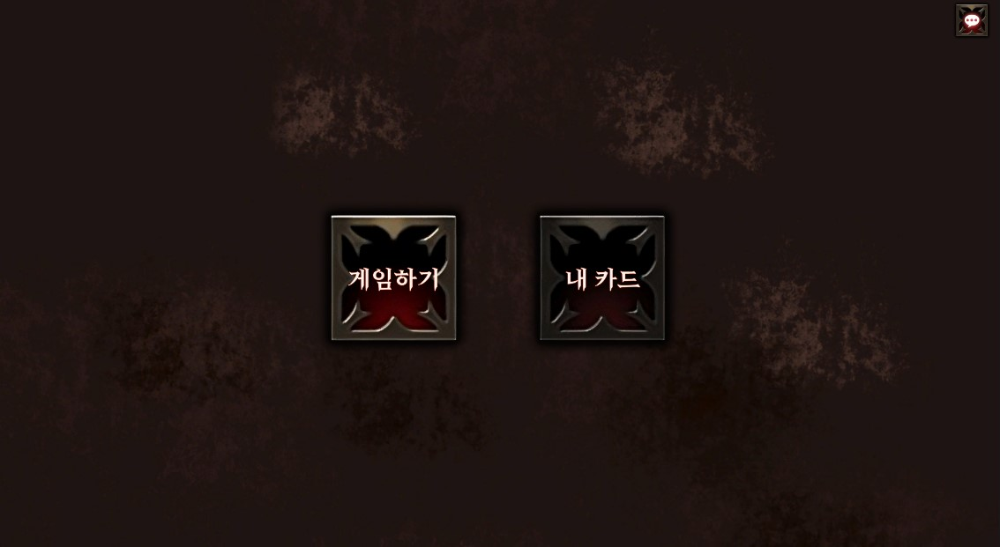
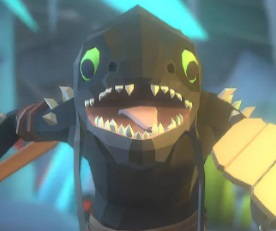
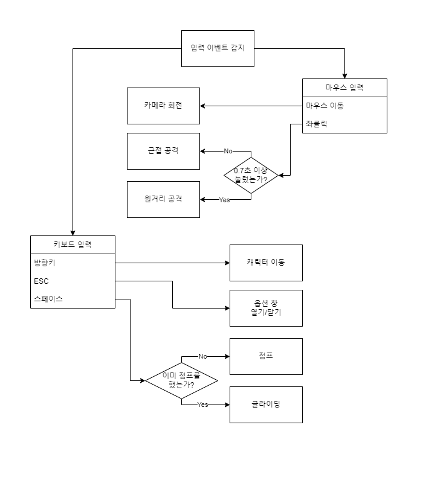

# PyDoingMe.github.io

# Whatever

# [ 목차 ]
### 1. [컨셉](#1)
### 2. [관련 이미지와 동영상](#2)
### 3. [대표 이미지](#3)
### 4. [컨셉 & 대표이미지 기반 작품 묘사](#0)
### 5. [Whatever 구성 요소](#4)
### 6. [게임 시스템 디자인](#5)
### 7. [요구사항](#6)
### 8. [흐름도](#7)
### 9. [스토리보드](#8)

  

# [컨셉] 

## 메인컨셉 :

큰 목적 없이 떠나는 방대한 모험

### 서브 컨셉 1 :

- 어드벤처
- 오픈 월드는 항상 다른 장르와 합쳐진 형태로 구현되는데, 어드벤처가 가장 오픈월드와 어울리는 장르라고 생각한다. 어드벤처라는 컨셉을 살리기 위해 맵을 탐사했을 때 플레이하는데 도움을 줄 수 있는 리워드를 제공하고자 한다.

### 서브 컨셉 2 :

- 캐주얼
- 오픈 월드의 특성 상 리소스 관리가 정말 어렵다. 폴리곤을 줄이기 위해 로우폴리 그래픽에 캐주얼한 디자인을 선택할 예정이다. 대신 쉐이더와 라이팅 기능에 많은 투자를 해서 캐주얼한 그래픽에서도 플레이어들이 긍정적인 평가를 이끌어내고자 한다. 

### 서브 컨셉 3 :

- 지형과 상호작용
- 상호작용을 할 수 있는 지형 요소를 넣을 생각이다. 지형과 상호작용을 통해 갈 수 없는 지형을 갈 수 있게 할 생각이다. 단순히 맵을 돌아다니기만 하면 쉽게 지루해질 수 있기 때문에 분위기를 환기시킬 수단으로 사용하고자 한다.

### 서브 컨셉 4 :

- 글라이딩
- 넓은 지형을 가시적으로 보여줄 수 있는 방법으로 글라이딩을 생각했다. 글라이딩을 하면서 본인이 지나다녔던 길들을 한 눈에 보여주고자 한다.

### 서브 컨셉 5 :

- 모험가
- 모험가라는 컨셉으로 로프, 모자같은 요소들로 위 요소들의 개연성과 통일감을 주고자 한다.

  

# [관련 이미지 & 동영상] 

- 이미지 1  
  
- 이미지 2  
  
- 이미지 3  
  
- 동영상
  

  

# [대표 이미지] 

  

# [컨셉 & 대표이미지 기반 작품묘사] 

> ### 대표이미지 기반 :
자연 배경에서 게임이 진행된다. 좌상단에는 유저가 방향성을 잃지 않도록 해야될 일을 알려주는 퀘스트 UI가 표기 된다. 초반에 조작키를 알려줄 때를 제외하면 사용되지 않는다. 우하단에는 미니맵이 제공된다. 이를 통해 플레이어는 방향과 위치를 알 수 있다. UI를 최소화해서 최대한 많은 풍경을 제공하고자 한다. UI가 줄어든 만큼 정보는 UI를 통해서 제공된다.

> ### 컨셉 기반:
장르의 특징을 잘 살릴 수 있는 모험가를 메인 컨셉으로 잡았다. 플레이어는 모험을 하면서 다양한 장소을 탐사할 수 있게 된다. 특별한 장소에 있는 포인트를 수집해서 능력치를 강화할 수 있으며, 모험가의 신비한 모자를 사용해서 적을 물리치고, 하늘을 활강하고, 멀리 있는 물건과 상호작용할 수 있다.
  

# [Whatever 구성 요소] 
제목
- Whatever

 

## 1. 메커니즘

[도전 과제]

1. 모든 지역을 탐사하라
2. 갈라진 고대 석판을 모아라
3. 편하게 쉬고 있는 보스를 물리쳐라

[재미 요소]

1. 넓은 월드 탐사 -> 새로운 곳을 탐험하는 재미
2. 글라이딩 -> 맨날 걷다가 날면 얻게 되는 쾌감
3. 아름다운 그래픽 -> 힐링
4. 맵과의 상호작용 -> 약간의 퍼즐 요소

 

## 2. 이야기

[만들게 된 배경]  

남들은 못 만드는 게임을 만들자는 단순한 사고에서 시작했습니다. '기술적으로 뛰어나되, 서사는 미니멀한 게임을 만들면 멋있겠다.'는 마음가짐으로 적합한 장르에 대해 생각했고, 그렇게 오픈 월드 어드벤처 장르를 선택하게 되었습니다. 기획 단계에서 모든 포커스는 오픈 월드의 강점을 살리는 방향으로만 집중했고, 지금의 생각없는 모험가의 이야기가 구상되었습니다.

[카메라 관점]  

여러분은 환경과 문화제 보호 따위는 딱히 신경쓰지 않는
무명의 모험가가 되어서 거대한 섬을 탐험하러 갑니다.
높은 절벽을 올라가고 나니, 평화로운 마을을 마주칩니다.
마을에서 '하늘이 춤추는 산'에 대한 전설을 듣게 되는데,
이 섬의 한 정중앙에는 거대한 산이 있으며,
고대의 석판을 모두 모으면 산 안으로 들어갈 수 있다는 이야기였습니다.
안에는 엄청난 보물이 있을 수도, 무서운 야수가 있을 수도 있다는 이야기에
엄청난 흥미를 느낀 모험가는 본격적인 모험을 시작하기로 합니다.

 

## 3. 미적요소

[디자인][컬러]  
캐릭터 디자인 
- 모자를 쓴 전형적인 모험가의 모습

배경/환경 디자인 
- 로우폴리에 아름다운 자연 관경, 들판과 산맥이 섞여 있다.

[음향]  
- 캐주얼한 로우폴리 모델링에 맞춰서 귀여운 효과음을 사용
- 마을에서는 행진곡, 자연에서는 캐논/야상곡, 전투 시에는 급박한 배경음악을 배치

 

## 4. 기술

Unity URP ( Universal Render Pipeline )
- 기존 빌트인 렌더 파이프라인과 다르게 추가 광원마다 드로우 콜을 렌더링하지 않기 때문에 넓은 지형인 오픈 월드에 유리할 걸로 예측

Pinwheel Studio - Polaris 2020
- 넓은 지형을 빠르게 모델링하는 동시에 폴리곤 수를 줄일 수 있는 에셋

메모리 풀과 맵 타일링
- 맵을 타일처럼 쪼개서 문자열 자료형으로 저장, 유저 근처의 지형만 렌더링
- 지역마다 오브젝트를 생성하는 게 아닌 메모리 풀에 저장된 오브젝트들의 위치값만 바꾸는 식으로 가비지컬렉션 호출을 줄여 초당 프레임 보존

 

# [게임 시스템 디자인] 

## 게임 오브젝트 분해

|오브젝트 이름|오브젝트 분류|오브젝트 이미지|
|---|---|---|
|Monya|Player||
|Hat|Equipment||
|GoldenHat|Equipment||
|(Relics)|Equipment||
|Nada|Boss||
|Lily|Moster||
|Petty|Moster||
|Ketty|Moster||
|(Animals)|Moster||
|Door|Environment||
|Tree|Environment||
|Ballista|Environment||
|Topography|Environment||
 

## 파라미터

### 1) 오브젝트 이름 : Player

속성|영문명칭|설명
---|---|---
float|movSpeed|이동 속도
float|attSpeed|공격 애니메이션 속도
int|attPower|공격력
bool|isCharge|차징 여부
CharacterController|chaController|부착된 캐릭터컨트롤러 컴포넌트
Animator|animator|부착된 애니메이터 컴포넌트
Image|hPUI|체력 UI
GameObject|hatObject|부착된 모자 오브젝트
GameObject|camArm|부착된 카메라 암 오브젝트
Camera|camera|부착된 카메라 컴포넌트
float|defaultFov|기본 시야 값
float|charageFov|차징 시, 시야 값
bool|hasHat|모자 오브젝트 소지 여부
int|maxHP|최대 체력
int|curHP|현재 체력
float|jumPower|점프력
bool|isJump|점프 여부
int|relCnt|수집한 원판 유물 횟수
 

### 2) 오브젝트 이름 : Boss

속성|영문명칭|설명
---|---|---
float|movSpeed|이동 속도
float|tilt|비행 시, 위/아래 각도
float|turn|비행 시, 좌/우 각도
float|attSpeed|공격 애니메이션 속도
int|attPower|공격력
CharacterController|chaController|부착된 캐릭터컨트롤러 컴포넌트
Animator|animator|부착된 애니메이터 컴포넌트
Slider|hPUI|체력 게이지 UI
int|maxHP|최대 체력
int|curHP|현재 체력
NavMeshAgent|nav|부착된 네브메시에이전트 컴포넌트
int|hitCnt|Tree/Ballista의 공격을 적중당한 횟수
Collider|col|플레이어 탐지 콜라이더
bool|isInBattle|전투 여부
bool|isFly|비행 여부
 

### 3) 오브젝트 이름 : (Monsters)

속성|영문명칭|설명
---|---|---
float|movSpeed|이동 속도
float|attSpeed|공격 애니메이션 속도
int|attPower|공격력
CharacterController|chaController|부착된 캐릭터컨트롤러 컴포넌트
Animator|animator|부착된 애니메이터 컴포넌트
Slider|hPUI|체력 게이지 UI
int|maxHP|최대 체력
int|curHP|현재 체력
NavMeshAgent|nav|부착된 네브메시에이전트 컴포넌트
Collider|col|플레이어 탐지 콜라이더
bool|isInBattle|전투 여부
 

### 4) 오브젝트 이름 : Tree, Ballista

속성|영문명칭|설명
---|---|---
int|attPower|공격력
Slider|hPUI|체력 게이지 UI
int|maxHP|최대 체력
int|curHP|현재 체력
 

### 5) 오브젝트 이름 : Hat, GHat

속성|영문명칭|설명
---|---|---
int|attPower|공격력
 

### 6) 오브젝트 이름 : (Relics)

속성|영문명칭|설명
---|---|---
int|params|올라갈 플레이어 능력치
 

## 행동

### 1) 오브젝트 이름 : Monya

영문명칭|설명
---|---
Input()|플레이어 입력
ForwardMove()|카메라 방향, 전/후 움직임
SideMove()|카메라 방향, 좌/우 움직임
Jump()|점프, 점프 상태라면 불발
Glide()|활강, 점프 상태가 아니면 불발
NearAttack()|근접 공격, 모자가 없으면 불발
FarAttack()|원거리 공격, 모자가 없으면 불발
Dying()|사망 처리
CamRotation()|카메라 회전
ChangeFov()|차징 여부에 따라 시야 변경
TakeDamage()|피격 시 발동, 체력 감소
TakeRelics()|유물 획득
 

### 2) 오브젝트 이름 : Nada

영문명칭|설명
---|---
FlyAttack()|비행 중일 때, 공격
GroundAttack()|비행 중이 아닐 때, 공격
LastAttack()|현재 체력이 최대 체력의 10분의 1이 되면 실행, 강력한 공격
Dying()|사망 처리
TakeDamage()|피격 시 발동, 체력 감소
FlyTo()|특정한 위치로 공중 이동
MoveTo()|특정한 위치로 지상 이동
Groggy()|행동 일시 정지
 

### 3) 오브젝트 이름 : (Monsters)

영문명칭|설명
---|---
Attack()|공격
Dying()|사망 처리
TakeDamage()|피격 시 발동, 체력 감소
MoveTo()|특정한 위치로 이동
 

### 4) 오브젝트 이름 : Tree, Ballista

영문명칭|설명
---|---
Attack()|공격
Dying()|사망 처리
TakeDamage()|피격 시 발동, 체력 감소
 

### 5) 오브젝트 이름 : Hat, GHat

영문명칭|설명
---|---
Attack()|공격
MoveTo()|특정한 위치로 이동
 

### 6) 오브젝트 이름 : (Relics)

영문명칭|설명
---|---
GiveParams()|플레이어와 닿으면 능력치 제공
 

### 7) 오브젝트 이름 : Door
영문명칭|설명
---|---
Open()|열림
 

## 상태

### 1) 오브젝트 이름 : Monya

현상태|전이상태|전이조건
---|---|---
Idle|Jump|space & !isJump
Jump|Glide|space(hold) & isJump
Idle|Move|arrow(hold) & !isJump
Idle/Jump|NearAttack|left mouse
Idle/Jump|Charge|left mouse(hold)
Charge|FarAttack|left mouse(release)
All|Die|curHP <= 0
All(without Die)|Idle|when animation is over
 

### 2) 오브젝트 이름 : Nada

현상태|전이상태|전이조건
---|---|---
Fly|FlyMove|FlyTo() or FlyAttack()
Fly|FlyAttack|FlyAttack()
FlyMove, FlyAttack|Fly|when animation is over
Fly,Idle|Groggy|hitCnt >= 3
Groggy|Idle|when animation is over
Idle|Move|GroundAttack() or MoveTo()
Idle|Attack|GroundAttack()
Idle|Fly|GroundAttack()
All|Die|curHP <= 0
 

### 3) 오브젝트 이름 : (Monsters)

현상태|전이상태|전이조건
---|---|---
Idle|Move|MoveTo()
Idle|Attack|Attack()
Idle, Attack|Hit|TakeDamage()
All|Die|curHP <= 0
All(without Die)|Idle|when animation is over

 

## 게임의 규칙

### 1) 핵심 규칙
- 체력이 0 이하가 되면 죽음
- 파격되거나 오브젝트 밑에 깔리면 피해를 입음
- Nada가 죽으면 게임에서 승리

### 2) 보조 규칙
- 마을에 가면 체력을 회복할 수 있음
- 마을에 가면 모자를 다시 획복할 수 있음
- 일반적인 조작으로 가지 못하는 곳을 특수한 조작으로 이동할 수 있음
- 유물을 획득해서 능력치를 상승

 

## 게임에 사용될 규칙
- 그로기 상태일 때, 데미지 = 기존 데미지 * 2
- 차징 시, 이동 속도 = 기존 이동 속도 / 1.3
- 글라이딩 시, 
	Vector3.x = Input.GetAxis(“Vertical”) * movSpeed + movSpeed
- 땅에 닿았을 때,
	Z 방향 가속도의 절대값이 30 이상일 때, |z가속도| // 10 - 2 의 피해를 입음

 

# [요구사항] 
- 캐릭터는 에셋을 사용한다.
- 지형을 에셋을 사용해 제작한다.
- 간단한 모델링은 3ds Max를 사용해 제작한다.
- 렌더 파이프라인은 URP를 사용한다.
- wind zone 컴포넌트를 이용해 자연스러운 자연요소 움직임을 구현한다.
- 씬은 시작/인게임/크레딧 총 3개로 구성된다.
- 씬-시작은 NewGame/LoadGame/ExitGame 총 3개의 버튼으로 구성된다.
- 게임은 Json파일로 정보를 저장했다가, LoadGame버튼을 누르면 불러오기된다.
- NewGame/LoadGame을 누르면 바로 씬-인게임으로 이동되고, ExitGame을 누르면 게임이 종료된다.
- 게임을 시작하면 지형이 일부 로딩되기 전까지 화면을 가려두는 검은 색 창이 뜬다.
- 지형은 TerrainData 형태로 저장했다가 카메라 컴포넌트의 ClippingPlanes.Far 값에 비례한 범위만 시각화한다.
- 나무와 같은 환경 요소는 StylizedTerrain 형태로 저장했다가 카메라 컴포넌트의 ClippingPlanes.Far를 /2 한 값에 비례한 범위만 시각화한다.
- 시각화한 데이터는 바로 지우지 않고, 일정 주기에 한 번에 정리한다.
- 게임은 3인칭 시점으로 진행된다.
- 게임이 처음 시작 되었을 때, 조작법을 좌측 상단의 텍스트로 표기한다.
- 우하단에 플레이어의 위치와 방향을 알려주는 미니맵 UI가 있다.
- 유물은 콜라이더끼리 접촉할 시, 이팩트를 발생하며 효과가 적용된다.
- 유물의 효과는 공격력/공격속도/체력/이동속도/relCnt 증가가 있다.
- 모자 오브젝트를 소지하고 있을 때는 플레이어 머리에 모자 모델이 보인다.
- 좌클릭을 0.7초 이하로 눌렀다 때면, 근접 공격이 나가고, 초과할 시에는 차징 상태에 돌입한다.
- 차징 상태에서 마우스를 때면, 원거리 공격이 나간다.
- 근접 공격은 모자를 휘두르고, 원거리 공격은 모자를 던진다.
- 원거리 공격이 시행되면, 모자 오브젝트는 충돌한 위치에 정지하게 되고, hasHat = false가 된다.
- 스페이스 바를 누르면 점프가 나간다.
- 한 번 점프를 누르면 바닥에 플레이어가 닿기 전까지 다시 점프를 할 수 없다.
- 점프를 이미 누른 상태에서 바닥에 닿기 전까지, 스페이스 바를 꾹 누르고 있으면 글라이딩을 할 수 있다.
- 글라이딩을 하면 모자를 늘려 낙하선처럼 사용한다.
- 동물들은 오브젝트 풀을 만들어 재사용한다.
- 몬스터들은 플레이어가 일정 범위 안에 들어오면, 공격을 한다.
- 몬스터들은 플레이어가 일정 범위 밖으로 나가면, 공격을 멈추고 체력이 회복된다.
- 동물들은 플레이어가 선제 공격을 해야지만 공격을 한다.
- 나무와 발리스타는 체력이 모두 소진되면 Attack()이 실행된 뒤 Die()가 실행된다.
- 나무의 공격은 쓰러지면서 충돌한 모든 체력을 가진 오브젝트에게 피해를 준다.
- 발리스타의 공격은 작살이 발사되면서 최초 충돌한 오브젝트가 체력을 가지고 있으면 피해를 준다.
- 플레이어는 마을에 가면 다시 체력이 회복된다.
- 체력이 0 이하가 되면 화면이 잠시 검은 창으로 덥혔다가, 씬-시작으로 이동한다.
- 맵 중앙에 있는 문은 relCnt == 4가 되면 열 수 있다.
- 글라이딩 중에는 fog가 강화되고, ClippingPlanes.Far가 줄어든다.
- esc키를 눌러 씬 이동을 하거나, 종료/저장할 수 있다.
- Nada가 죽으면 자동으로 저장한 후에 씬-크레딧으로 이동했다가 씬-시작으로 이동한다.

 

# [흐름도] 

 

# [스토리보드] 

