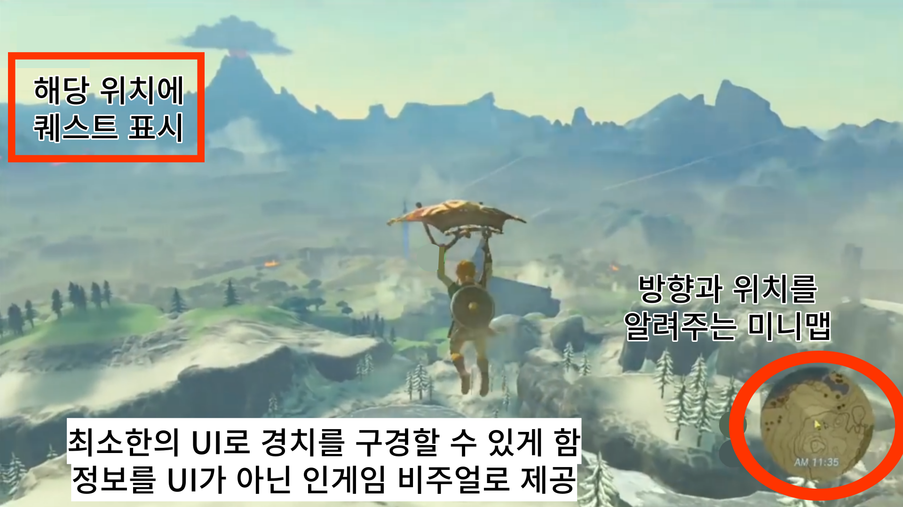

# PyDoingMe.github.io

# Whatever

# [ 목차 ]
### 1. [컨셉](#1)
### 2. [관련 이미지와 동영상](#2)
### 3. [대표 이미지 그리고 컨셉과 대표이미지 기반 작품 묘사](#3)
### 4. [Whatever 구성 요소](#4)
### 5. [게임 시스템 디자인](#5)
### 6. [요구사항(6주차)](#6)

# [컨셉] 

## 메인컨셉 :

큰 목적 없이 떠나는 방대한 모험

### 서브 컨셉 1 :

- 어드벤처
- 오픈 월드는 항상 다른 장르와 합쳐진 형태로 구현되는데, 어드벤처가 가장 오픈월드와 어울리는 장르라고 생각한다. 어드벤처라는 컨셉을 살리기 위해 맵을 탐사했을 때 플레이하는데 도움을 줄 수 있는 리워드를 제공하고자 한다.

### 서브 컨셉 2 :

- 캐주얼
- 오픈 월드의 특성 상 리소스 관리가 정말 어렵다. 폴리곤을 줄이기 위해 로우폴리 그래픽에 캐주얼한 디자인을 선택할 예정이다. 대신 쉐이더와 라이팅 기능에 많은 투자를 해서 캐주얼한 그래픽에서도 플레이어들이 긍정적인 평가를 이끌어내고자 한다. 

### 서브 컨셉 3 :

- 지형과 상호작용
- 상호작용을 할 수 있는 지형 요소를 넣을 생각이다. 지형과 상호작용을 통해 갈 수 없는 지형을 갈 수 있게 할 생각이다. 단순히 맵을 돌아다니기만 하면 쉽게 지루해질 수 있기 때문에 분위기를 환기시킬 수단으로 사용하고자 한다.

### 서브 컨셉 4 :

- 글라이딩
- 넓은 지형을 가시적으로 보여줄 수 있는 방법으로 글라이딩을 생각했다. 글라이딩을 하면서 본인이 지나다녔던 길들을 한 눈에 보여주고자 한다.

### 서브 컨셉 5 :

- 모험가
- 모험가라는 컨셉으로 로프, 모자같은 요소들로 위 요소들의 개연성과 통일감을 주고자 한다.

  

# [관련 이미지 & 동영상] 

- 이미지 1  
  
- 이미지 2  
  
- 이미지 3  
  
- 동영상
  

  

# [대표 이미지] 

  

# [컨셉 & 대표이미지 기반 작품묘사]

> ### 대표이미지 기반 :

> ### 컨셉 기반:

  

# [<게임제목> 구성 요소] 

- Whatever

 

## 1. 메커니즘

[도전 과제]

1. 모든 지역을 탐사하라
2. 갈라진 고대 석판을 모아라
3. 편하게 쉬고 있는 보스를 물리쳐라

[재미 요소]

1. 넓은 월드 탐사 -> 새로운 곳을 탐험하는 재미
2. 글라이딩 -> 맨날 걷다가 날면 얻게 되는 쾌감
3. 아름다운 그래픽 -> 힐링
4. 맵과의 상호작용 -> 약간의 퍼즐 요소

 

## 2. 이야기

[만들게 된 배경]  
남들은 못 만드는 게임을 만들자는 단순한 사고에서 시작했습니다. '기술적으로 뛰어나되, 서사는 미니멀한 게임을 만들면 멋있겠다.'는 마음가짐으로 적합한 장르에 대해 생각했고, 그렇게 오픈 월드 어드벤처 장르를 선택하게 되었습니다. 기획 단계에서 모든 포커스는 오픈 월드의 강점을 살리는 방향으로만 집중했고, 지금의 생각없는 모험가의 이야기가 구상되었습니다.

[카메라 관점]  
여러분은 환경과 문화제 보호 따위는 딱히 신경쓰지 않는
무명의 모험가가 되어서 거대한 섬을 탐험하러 갑니다.
높은 절벽을 올라가고 나니, 평화로운 마을을 마주칩니다.
마을에서 '하늘이 춤추는 산'에 대한 전설을 듣게 되는데,
이 섬의 한 정중앙에는 거대한 산이 있으며,
고대의 석판을 모두 모으면 산 안으로 들어갈 수 있다는 이야기였습니다.
안에는 엄청난 보물이 있을 수도, 무서운 야수가 있을 수도 있다는 이야기에
엄청난 흥미를 느낀 모험가는 본격적인 모험을 시작하기로 합니다.

 

## 3. 미적요소

[디자인][컬러]  
캐릭터 디자인 
- 모자를 쓴 전형적인 모험가의 모습

배경/환경 디자인 
- 로우폴리에 아름다운 자연 관경, 들판과 산맥이 섞여 있다.

[음향]  
- 캐주얼한 로우폴리 모델링에 맞춰서 귀여운 효과음을 사용
- 마을에서는 행진곡, 자연에서는 캐논/야상곡, 전투 시에는 급박한 배경음악을 배치
 

## 4. 기술

Unity URP ( Universal Render Pipeline )
- 기존 빌트인 렌더 파이프라인과 다르게 추가 광원마다 드로우 콜을 렌더링하지 않기 때문에 넓은 지형인 오픈 월드에 유리할 걸로 예측

Pinwheel Studio - Polaris 2020
- 넓은 지형을 빠르게 모델링하는 동시에 폴리곤 수를 줄일 수 있는 에셋

메모리 풀과 맵 타일링
- 맵을 타일처럼 쪼개서 문자열 자료형으로 저장, 유저 근처의 지형만 렌더링
- 지역마다 오브젝트를 생성하는 게 아닌 메모리 풀에 저장된 오브젝트들의 위치값만 바꾸는 식으로 가비지컬렉션 호출을 줄여 초당 프레임 보존
